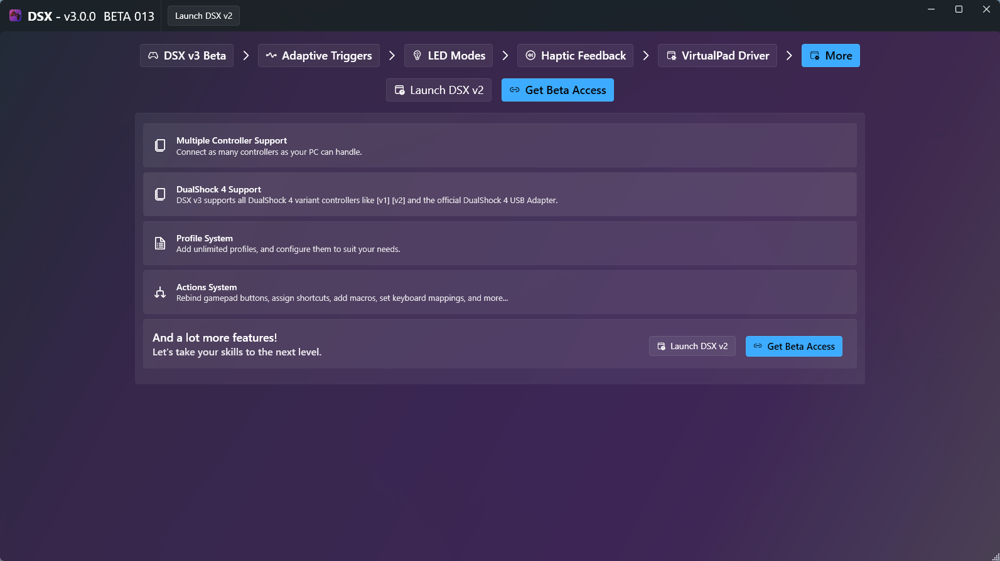
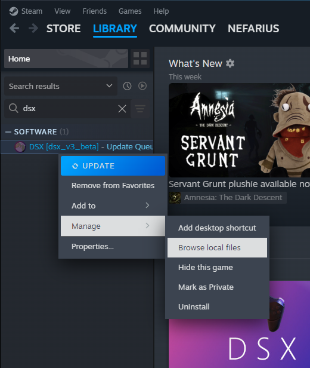
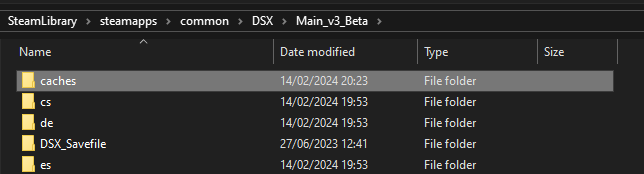

# Frequently Asked Questions

## I just purchased the DSE DLC but the app still doesn't let me continue

### Problem

You can't advance past the `Get Beta Access` screen despite just having purchased the DSE DLC:

### Solution

- Make sure DSX is **closed**
- In Steam, navigate to the installation directory like so:  
  
- Go into the `Main_v3_Beta` folder:  
  
- **Delete** the `caches` directory:  
  
- Re-launch DSX and it should be good!

## Where can I find the application logs

- In Steam, navigate to the installation directory like so:  
  
- Go into the `Main_v3_Beta` folder:  
  
- Go into the `logs` folder:  
  
- In here sort by `Date Modified` to have the most recent files on top:  
  
- Share the `dsx-20240214.log` file (different name on your machine) with support on Discord
